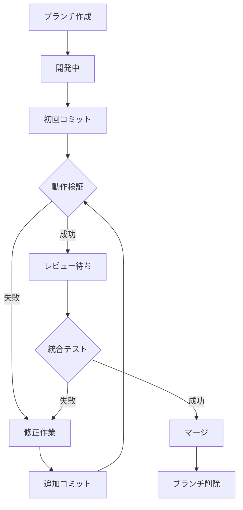

# ブランチライフサイクル管理

## 🌳 ブランチの状態遷移



## 📋 ブランチ管理ルール

### 1. ブランチを残すべきタイミング

#### ✅ 保持する場合
- 動作検証が未完了
- エラー修正中
- レビュー待ち
- 統合テスト中
- 他のブランチとの依存関係がある

#### ❌ 削除してよい場合
- マージ完了
- 全テスト合格
- 本番環境で動作確認済み
- rollbackの必要性がない

### 2. ブランチ状態の可視化

```bash
# ブランチにタグをつけて状態管理
git branch --list --format='%(refname:short) [%(upstream:track)]'

# 推奨: ブランチ名に状態を含める
feat/frontend-dev     # 開発中
feat/frontend-testing # テスト中
feat/frontend-ready   # マージ準備完了
```

### 3. サブエージェントの責任範囲

```yaml
開発エージェント:
  1. 機能実装
  2. 初回コミット
  3. ブランチに「-dev」サフィックス

テストエージェント:
  1. 同じブランチで作業継続
  2. エラー修正
  3. 修正コミット
  4. ブランチ名を「-testing」に変更

統合エージェント:
  1. 全ブランチの状態確認
  2. 統合テスト実施
  3. 成功時のみ「-ready」に変更
  4. マージ実行
  5. ブランチ削除
```

## 🔄 修正フロー

### エラー発見時の処理

```bash
# 1. 元のworktreeに戻る（削除していない前提）
cd ./worktrees/mission-frontend

# 2. エラー修正
# ファイル編集...

# 3. 修正をコミット
git add .
git commit -m "fix: Chart.jsアダプターエラーを修正"

# 4. 再度テスト
npm test
open index.html

# 5. 成功したらマージ準備
git push origin feat/frontend
```

### worktreeの扱い

```bash
# ❌ 悪い例: 早すぎる削除
git worktree remove ./worktrees/mission-frontend  # まだテスト未完了！

# ✅ 良い例: 適切なタイミング
# テスト完了・マージ後に削除
git merge feat/frontend
git worktree remove ./worktrees/mission-frontend
git branch -d feat/frontend
```

## 🏁 完了条件チェックリスト

ブランチを削除する前に確認：

- [ ] 全ての機能が実装済み
- [ ] 単体テスト合格
- [ ] 統合テスト合格
- [ ] コンソールエラーなし
- [ ] パフォーマンス基準達成
- [ ] ドキュメント更新済み
- [ ] マージ完了
- [ ] 本番環境で動作確認（必要な場合）

## 📊 状態管理テーブル

| ブランチ | 状態 | worktree | 次のアクション |
|---------|------|----------|--------------|
| feat/frontend | 開発中 | 保持 | テスト実行 |
| feat/backend | テスト中 | 保持 | エラー修正 |
| feat/ux | レビュー待ち | 保持 | 統合テスト |
| feat/old-feature | マージ済み | 削除可 | クリーンアップ |

## 🔧 Git設定の推奨

```bash
# ブランチ保護設定
git config --global branch.feat/*.rebase false

# マージ前の確認を強制
git config --global merge.feat/*.verify true

# worktreeの自動クリーンアップを無効化
git config worktree.guessRemote false
```

## 💡 ベストプラクティス

1. **早すぎる削除を避ける**: テストが完全に終わるまでブランチは残す
2. **状態の可視化**: ブランチ名やタグで現在の状態を明確にする
3. **責任の明確化**: 誰がいつブランチを削除できるかを決める
4. **履歴の保持**: 重要な修正履歴は squash せずに残す
5. **定期的なクリーンアップ**: 週次でマージ済みブランチを整理

---

この管理方法により、エラー修正時も適切にブランチとworktreeを活用でき、品質向上につながります。