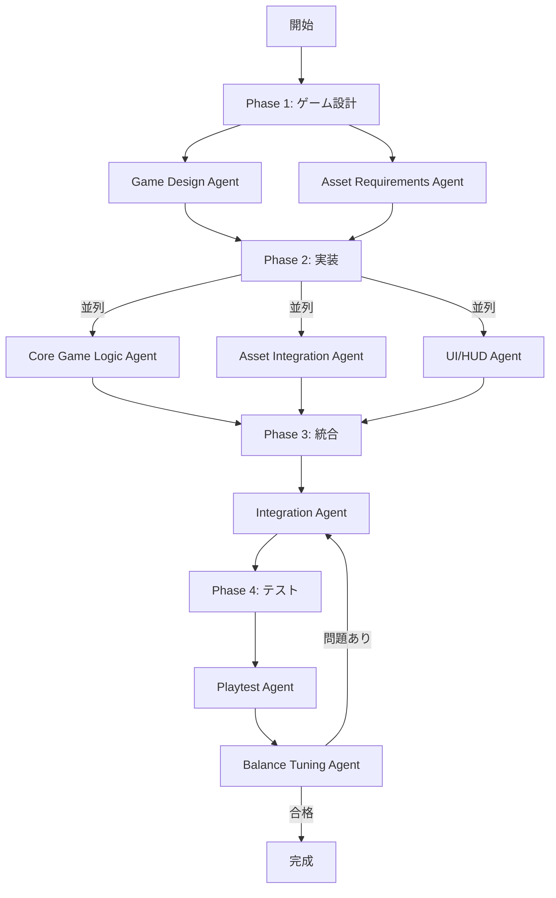

# 🎮 ゲーム開発専門ワークフロー

## 📋 問題分析

### 現在の課題
1. **アセット管理の失敗**
   - 指定した画像が使用されない
   - キャラクターデザインが反映されない

2. **統合テストの欠如**
   - 単体テスト: ✅ 100%合格
   - 統合テスト: ❌ 実行時にエラー
   - 各モジュール間の連携が未検証

3. **ゲーム特有の要件への対応不足**
   - ゲームバランス調整なし
   - UX/操作性の検証なし
   - パフォーマンス最適化なし

## 🎯 実際のゲーム開発現場の役割

### コア開発チーム
1. **Game Designer（ゲームデザイナー）**
   - ゲームルール設計
   - レベルデザイン
   - バランス調整

2. **Game Programmer（ゲームプログラマー）**
   - ゲームロジック実装
   - 物理エンジン統合
   - 入力制御

3. **Graphics Programmer（グラフィックスプログラマー）**
   - レンダリング最適化
   - エフェクト実装
   - アニメーションシステム

### アート・アセットチーム
4. **Art Director（アートディレクター）**
   - ビジュアルスタイル統括
   - アセット仕様決定

5. **Character Artist（キャラクターアーティスト）**
   - キャラクターデザイン
   - スプライト作成
   - アニメーション素材

6. **UI/UX Designer（UI/UXデザイナー）**
   - 画面設計
   - 操作フロー最適化
   - フィードバック設計

### 品質保証チーム
7. **QA Tester（品質保証テスター）**
   - プレイテスト
   - バグ発見
   - バランステスト

8. **Integration Tester（統合テスター）**
   - モジュール間連携テスト
   - 全体動作確認
   - パフォーマンステスト

## 🤖 提案するゲーム開発専用サブエージェント

### Phase 1: ゲーム設計フェーズ

#### 1. Game Design Agent（ゲームデザインエージェント）
```yaml
責任範囲:
  - ゲームルール明確化
  - 難易度カーブ設計
  - スコアリングシステム
  - パワーアップ・武器システム

成果物:
  - game_design_document.md
  - level_progression.json
  - balancing_parameters.json
```

#### 2. Asset Requirements Agent（アセット要件エージェント）
```yaml
責任範囲:
  - 必要な画像リスト作成
  - 画像仕様定義（サイズ、形式）
  - アニメーション要件定義
  - 音効要件定義

成果物:
  - asset_requirements.md
  - sprite_specifications.json
  - asset_checklist.md
```

### Phase 2: 実装フェーズ（並列実行）

#### 3. Core Game Logic Agent（ゲームロジックエージェント）
```yaml
責任範囲:
  - プレイヤー制御
  - 敵AI実装
  - 衝突判定
  - スコアリング

依存: game_design_document.md
成果物:
  - src/game/player.js
  - src/game/enemy.js
  - src/game/collision.js
```

#### 4. Asset Integration Agent（アセット統合エージェント）
```yaml
責任範囲:
  - 画像ファイルの配置
  - スプライトローダー実装
  - アニメーションシステム
  - 画像最適化

依存: asset_requirements.md
成果物:
  - src/assets/（画像ファイル群）
  - src/game/assetLoader.js
  - src/game/animation.js
```

#### 5. UI/HUD Agent（UI/HUDエージェント）
```yaml
責任範囲:
  - スコア表示
  - ライフ/HP表示
  - ゲームオーバー画面
  - スタート画面

成果物:
  - src/ui/hud.js
  - src/ui/screens.js
  - styles/game-ui.css
```

### Phase 3: 統合・テストフェーズ

#### 6. Integration Agent（統合エージェント）
```yaml
責任範囲:
  - モジュール間の接続
  - イベントシステム構築
  - 状態管理統合
  - 全体フロー確認

成果物:
  - src/game/gameManager.js
  - src/game/eventSystem.js
  - integration_report.md
```

#### 7. Playtest Agent（プレイテストエージェント）
```yaml
責任範囲:
  - 実際にゲームを起動
  - 全機能の動作確認
  - エラーログ収集
  - プレイアビリティ評価

成果物:
  - playtest_report.md
  - bug_list.md
  - performance_metrics.json
```

#### 8. Balance Tuning Agent（バランス調整エージェント）
```yaml
責任範囲:
  - 難易度調整
  - 敵の出現パターン最適化
  - 武器バランス調整
  - スコアリング調整

成果物:
  - tuned_parameters.json
  - balance_report.md
```

## 📊 改善されたワークフロー



## 🎯 重要な改善点

### 1. アセット管理の改善
```javascript
// Asset Integration Agent が生成するコード例
class AssetLoader {
  constructor() {
    this.assets = {
      player: {
        path: 'assets/player.png',
        width: 64,
        height: 64,
        frames: 4
      },
      enemy: {
        path: 'assets/enemy.png',
        width: 32,
        height: 32,
        frames: 2
      }
    };
  }

  async loadAll() {
    // 指定された画像を確実にロード
    for (const [key, config of Object.entries(this.assets)) {
      await this.loadImage(key, config);
    }
  }
}
```

### 2. 統合テストの追加
```javascript
// Playtest Agent が実行するテスト
describe('統合テスト', () => {
  it('ゲーム全体が起動する', async () => {
    const game = new GameManager();
    await game.initialize();
    expect(game.isRunning).toBe(true);
  });

  it('プレイヤーが画面に表示される', () => {
    const player = game.getPlayer();
    expect(player.sprite).toBeDefined();
    expect(player.isVisible).toBe(true);
  });

  it('敵とプレイヤーの衝突が検出される', () => {
    const collision = game.checkCollision(player, enemy);
    expect(collision).toBeDefined();
  });
});
```

## 📝 サブエージェント用プロンプトテンプレート

### Asset Integration Agent 用プロンプト
```
あなたはゲーム開発のアセット統合専門家です。

【重要な責務】
1. 指定された画像ファイルを必ず使用する
2. 画像が存在しない場合は、プレースホルダーを作成
3. すべてのアセットのロード確認を行う

【確認事項】
- assets/player.png は存在するか？
- assets/enemy.png は存在するか？
- 各画像のサイズと形式は適切か？

【実装必須機能】
- アセットローダークラス
- エラーハンドリング（画像が見つからない場合）
- フォールバック機能（デフォルト画像）
```

### Playtest Agent 用プロンプト
```
あなたはゲームQAテスターです。

【テスト手順】
1. npm start でゲームを起動
2. ブラウザで実際に動作確認
3. すべての操作を試す
   - 移動（上下左右）
   - 射撃
   - 敵との衝突
   - ゲームオーバー
   - リスタート

【レポート項目】
- 起動時のエラー
- 操作の反応性
- 画像表示の問題
- パフォーマンス問題
- バグリスト
```

## 🚀 実装手順

1. **新しいサブエージェントプロンプトを作成**
   ```bash
   touch GAME_SUBAGENT_PROMPTS.md
   ```

2. **ワークフローに統合**
   - Phase 2 に Asset Integration Agent を追加
   - Phase 3 後に Integration & Playtest フェーズを追加

3. **テスト強化**
   - 単体テスト＋統合テスト＋プレイテスト

## ✅ 期待される改善

1. **画像が確実に反映される**
   - Asset Integration Agent が責任を持つ
   - チェックリストで確認

2. **統合テストで問題を発見**
   - Playtest Agent が実際に起動確認
   - Integration Agent がモジュール連携確認

3. **ゲームとして完成度向上**
   - バランス調整
   - UX改善
   - パフォーマンス最適化