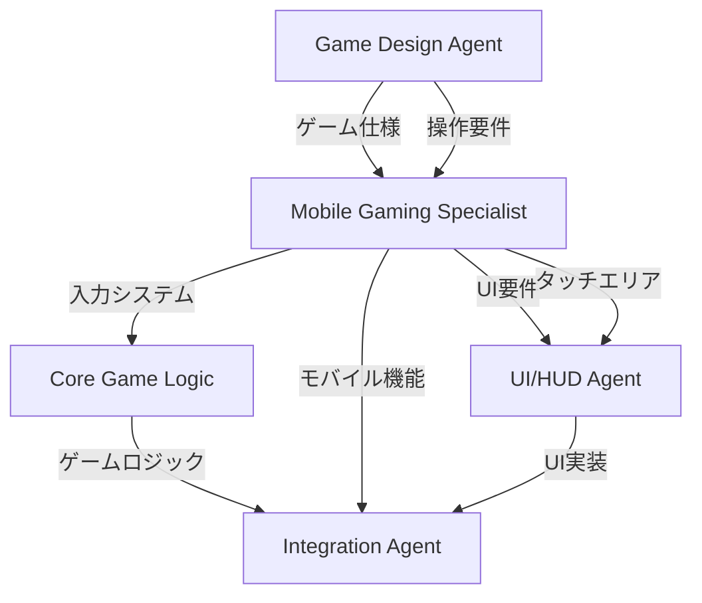

# 📱 モバイルゲーム開発ワークフロー統合ガイド

## 🎯 統合戦略

モバイル傾き操作ゲームを開発する際、Mobile Gaming Specialist Agent を自動的に起動し、
確実に傾き操作とタッチ操作を実装する仕組みを構築します。

## 📋 PROJECT_INFO.yaml での識別

### モバイルゲームの判定条件

```yaml
# PROJECT_INFO.yaml
project_name: "Space Tilt Shooter"
project_type: "game"
game_genre: "shooting"
platform: "mobile"  # ← NEW! モバイルプラットフォーム指定
mobile_features:    # ← NEW! モバイル機能の明示
  - tilt_control    # 傾き操作
  - touch_input     # タッチ入力
  - landscape_mode  # 横画面モード
development_type: "Portfolio App"
```

## 🔄 ワークフロー変更点

### Phase 1: 要件定義（拡張）

```python
# workflow_orchestrator.py の判定ロジック
def determine_agents_for_phase2(project_info):
    agents = []

    if project_info.get('project_type') == 'game':
        agents.append('Core Game Logic Agent')

        # モバイルゲーム判定
        if (project_info.get('platform') == 'mobile' or
            'tilt_control' in project_info.get('mobile_features', [])):
            agents.append('Mobile Gaming Specialist Agent')  # 追加

        agents.append('Asset Integration Agent')
        agents.append('UI/HUD Agent')

    return agents
```

### Phase 2: 実装フェーズの拡張

```yaml
Phase 2: ゲーム実装
  条件: project_type == "game" && platform == "mobile"

  並列実行:
    1. Core Game Logic Agent
       - 基本ゲームロジック
       - 物理エンジン

    2. Mobile Gaming Specialist Agent  # NEW!
       - TiltController実装
       - TouchController実装
       - OrientationManager実装
       - フォールバック操作

    3. Asset Integration Agent
       - 画像最適化（モバイル向けサイズ調整）
       - タッチUI素材の準備

    4. UI/HUD Agent
       - モバイル最適化UI
       - タッチ可能なボタン配置
       - 傾きインジケーター
```

## 📝 エージェント間の連携

### データフロー



### 共有インターフェース

```javascript
// shared/MobileGameInterface.js
export interface MobileGameConfig {
  // 傾き操作設定
  tilt: {
    enabled: boolean;
    sensitivity: number;
    deadZone: number;
    maxTilt: number;
  };

  // タッチ操作設定
  touch: {
    enabled: boolean;
    multiTouch: boolean;
    gestures: string[];
  };

  // 画面設定
  orientation: {
    preferred: 'landscape' | 'portrait';
    locked: boolean;
  };

  // フォールバック
  fallback: {
    virtualJoystick: boolean;
    touchZones: boolean;
  };
}
```

## 🤖 サブエージェントへの指示テンプレート

### Mobile Gaming Specialist Agent 起動プロンプト

```markdown
あなたはモバイルゲーム開発のスペシャリストです。

【プロジェクト情報】
- ゲーム名: {project_name}
- ジャンル: {game_genre}
- プラットフォーム: モバイル（スマートフォン/タブレット）

【必須実装機能】
1. 傾き操作システム
   - MOBILE_TILT_CONTROL_SPEC.md に完全準拠
   - 横画面での軸変換を正確に実装
   - iOS/Android両対応

2. タッチ操作
   - シングル/マルチタッチ対応
   - ゲームジャンルに応じた操作マッピング

3. フォールバック機能
   - センサー非対応デバイス向け
   - バーチャルジョイスティック
   - タッチゾーン操作

【成果物チェックリスト】
- [ ] TiltController.js（傾き制御）
- [ ] TouchController.js（タッチ制御）
- [ ] OrientationManager.js（画面向き管理）
- [ ] MobileInputManager.js（統合管理）
- [ ] FallbackController.js（代替操作）
- [ ] mobile-game.css（モバイルUI）
- [ ] 動作確認用テストコード

【品質要件】
- 60FPS維持
- バッテリー効率考慮
- 直感的な操作性
```

## 🎮 ゲームジャンル別の実装パターン

### シューティングゲーム

```javascript
// config/mobile_shooting_config.js
export const SHOOTING_CONFIG = {
  tilt: {
    enabled: true,
    sensitivity: 2.0,
    deadZone: 5,
    maxTilt: 30,
    smoothing: 0.2
  },
  touch: {
    singleTap: 'shoot',
    doubleTap: 'specialWeapon',
    hold: 'continuousFire',
    twoFingerTap: 'bomb'
  },
  orientation: 'landscape'
};
```

### レースゲーム

```javascript
// config/mobile_racing_config.js
export const RACING_CONFIG = {
  tilt: {
    enabled: true,
    sensitivity: 3.0,  // より敏感に
    deadZone: 3,
    maxTilt: 45,       // より大きな傾き
    axis: 'gamma'      // 左右の傾きのみ使用
  },
  touch: {
    leftHalf: 'brake',
    rightHalf: 'accelerate',
    swipeUp: 'boost',
    swipeDown: 'handbrake'
  },
  orientation: 'landscape'
};
```

### パズルゲーム

```javascript
// config/mobile_puzzle_config.js
export const PUZZLE_CONFIG = {
  tilt: {
    enabled: true,
    sensitivity: 1.5,  // 穏やかな動き
    deadZone: 8,       // 大きめのデッドゾーン
    maxTilt: 20,
    smoothing: 0.3
  },
  touch: {
    tap: 'select',
    swipe: 'move',
    pinch: 'zoom',
    rotate: 'rotatePiece'
  },
  orientation: 'portrait'  // 縦画面も可
};
```

## 📋 自動判定ロジック

### プロジェクトタイプの自動識別

```python
# src/project_analyzer.py
class ProjectAnalyzer:
    def analyze_mobile_requirements(self, project_info):
        """モバイル機能の必要性を判定"""

        indicators = {
            'explicit_mobile': False,
            'tilt_control': False,
            'touch_optimized': False,
            'mobile_genre': False
        }

        # 明示的な指定
        if project_info.get('platform') == 'mobile':
            indicators['explicit_mobile'] = True

        # モバイル機能の指定
        mobile_features = project_info.get('mobile_features', [])
        if 'tilt_control' in mobile_features:
            indicators['tilt_control'] = True

        # ゲームジャンルからの推定
        mobile_friendly_genres = ['endless_runner', 'casual', 'arcade']
        if project_info.get('game_genre') in mobile_friendly_genres:
            indicators['mobile_genre'] = True

        # キーワード検出
        description = project_info.get('description', '').lower()
        mobile_keywords = ['スマホ', 'タブレット', 'mobile', 'touch', 'tilt', '傾き']
        if any(keyword in description for keyword in mobile_keywords):
            indicators['touch_optimized'] = True

        # 判定
        return any(indicators.values()), indicators

    def get_mobile_config(self, project_info):
        """モバイル設定を生成"""

        is_mobile, indicators = self.analyze_mobile_requirements(project_info)

        if not is_mobile:
            return None

        config = {
            'agents': ['Mobile Gaming Specialist Agent'],
            'features': [],
            'priority': 'high'
        }

        if indicators['tilt_control']:
            config['features'].append('tilt_control')

        if indicators['touch_optimized']:
            config['features'].append('advanced_touch')

        return config
```

## ✅ 実装チェックリスト

### エージェント起動前の確認

- [ ] PROJECT_INFO.yaml にplatform指定があるか
- [ ] mobile_featuresが定義されているか
- [ ] ゲームジャンルがモバイル向きか

### エージェント実行中の確認

- [ ] TiltControllerが実装されているか
- [ ] 横画面での軸変換が正しいか
- [ ] iOS権限処理が実装されているか
- [ ] フォールバック機能があるか

### エージェント完了後の確認

- [ ] モバイル操作のテストコードが生成されているか
- [ ] チュートリアルが実装されているか
- [ ] パフォーマンスが60FPS維持できるか

## 🚀 使用例

### 1. 新規モバイルゲーム作成

```bash
./create_new_app.command
> プロジェクト名: tilt-shooter
> プロジェクトタイプ: game
> ゲームジャンル: shooting
> プラットフォーム: mobile  # ← ここで指定
> モバイル機能: tilt_control, touch_input
```

### 2. Claude Code での開発依頼

```
「傾き操作で移動し、タップで射撃するシューティングゲームを作って。
スマホを横向きにして遊ぶゲームにしたい。」
```

### 3. 自動実行される処理

1. PROJECT_INFO.yaml にmobile設定を記録
2. Phase 2でMobile Gaming Specialist Agentを起動
3. MOBILE_TILT_CONTROL_SPEC.mdに基づいて実装
4. 完全なモバイル操作システムを生成

## 📊 期待される成果

### 生成されるファイル構造

```
project/
├── src/
│   ├── mobile/
│   │   ├── TiltController.js      # 傾き制御
│   │   ├── TouchController.js     # タッチ制御
│   │   ├── OrientationManager.js  # 画面向き管理
│   │   ├── MobileInputManager.js  # 統合管理
│   │   └── FallbackController.js  # 代替操作
│   ├── game/
│   │   └── MobileGame.js          # モバイルゲーム本体
│   └── config/
│       └── mobile_config.js       # モバイル設定
├── styles/
│   └── mobile-game.css           # モバイル最適化CSS
├── tests/
│   └── mobile_controls.test.js   # モバイル操作テスト
└── docs/
    └── MOBILE_CONTROLS.md        # 操作説明書
```

### 品質保証

| 項目 | 基準 | チェック |
|------|------|----------|
| 傾き操作 | 横画面で正確に動作 | ✓ |
| iOS対応 | Safari権限処理 | ✓ |
| Android対応 | Chrome完全動作 | ✓ |
| フォールバック | センサー非対応でも操作可能 | ✓ |
| パフォーマンス | 60FPS維持 | ✓ |
| バッテリー | 効率的な更新処理 | ✓ |

## 🔧 トラブルシューティング

### よくある問題と解決策

1. **権限が取得できない**
   - iOS 13以降はHTTPS必須
   - ユーザージェスチャー（ボタンクリック）が必要

2. **軸が逆になる**
   - 横画面での変換式を確認
   - デバイスの持ち方（ホームボタン位置）を考慮

3. **動きがカクカクする**
   - スロットリング間隔を調整（16ms → 33ms）
   - スムージング係数を増やす（0.2 → 0.3）

4. **バッテリー消費が激しい**
   - 非アクティブ時はリスナーを解除
   - 更新頻度を最適化