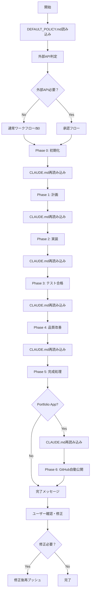

# 🚀 Claude Code用 ワークフロー実行ガイド

## 📌 このファイルの目的

Claude Codeが確実にワークフローを実行できるよう、最重要ポイントをまとめたガイドです。

## 🚨 v7.0 最重要変更
**Phase 0〜6まで中断なく一気通貫で自動実行する**
- Portfolio App: Phase 6（GitHub公開）まで自動実行
- Client App: Phase 5まで自動実行
- ユーザー確認は最後のみ

## 🔴 絶対に守る3つのルール

### 1. 各Task実行前にCLAUDE.mdを読み直す
```yaml
理由: "長時間実行でワークフローを忘れないため"
実行: "各フェーズ開始時、各Task実行前"
```

### 2. DEFAULT_POLICY.mdを最初に必ず読む
```yaml
理由: "$0・全自動が最優先原則"
確認: "外部API要否を判定"
```

### 3. frontend-designスキルを明示的に使用
```yaml
対象: ["about.html", "UIコンポーネント", "ランディング"]
宣言: "use the frontend design skill"
```

### 4. 修正時はWORKTREE_INDEX.mdを参照
```yaml
Phase 7実行時: "WORKTREE_INDEX.mdを読んで適切なworktreeを選択"
理由: "修正内容に応じた最適な作業場所を判断するため"
```

## 📋 ワークフロー実行フロー（v7.0 一気通貫版）



## 🚨 Phase 5で絶対に忘れないタスク

### documenter_agent.py の実行（最重要）
```bash
# これを忘れると about.html が生成されない！
python3 ~/Desktop/git-worktree-agent/src/documenter_agent.py
```

### ⚠️ Phase 5完了後の自動処理（v7.0）
```
Phase 5完了（project/public/ に公開ファイル生成）
↓ PROJECT_INFO.yaml確認
↓ Portfolio Appの場合のみ自動実行
Phase 6: simplified_github_publisher.py実行
↓
完了メッセージとURL表示
```

### 生成物チェックリスト
- [ ] README.md
- [ ] about.html（frontend-design skill使用）
- [ ] audio_script.txt
- [ ] explanation.mp3（Gemini TTS優先、GCPフォールバック）
- [ ] launch_app.command（chmod +x済み）

### 音声生成の優先順位
1. **Gemini 2.5 Flash Preview TTS（推奨）**: GEMINI_API_KEY設定時
2. **GCP Text-to-Speech（フォールバック）**: GCP認証ファイル存在時
3. **スキップ**: 両方未設定の場合（理由をREADME.mdに記録）

## 🚀 Phase 6: GitHub自動公開（v7.0新仕様）

### simplified_github_publisher.py の実行
```bash
# project/public/ を ai-agent-portfolio/<app-name>/ に直接公開
# （プロンプトや.env/credentials/.gitignore等の機密・一時ファイルは自動除外）
# （Webアプリ/ゲームはビルド済み index.html + assets/ + dist/ を含めるが、node_modules/testコードは除外）
python3 ~/Desktop/git-worktree-agent/src/simplified_github_publisher.py .

# 結果: https://github.com/sohei-t/ai-agent-portfolio/tree/main/{app-name}/ に配置
# 既存の同名フォルダがある場合はフォルダ名を変えず、中身のみ更新
```

### 公開構造
```
ai-agent-portfolio/
├── todo-app/         # project/public/ の公開物
│   ├── index.html
│   ├── about.html    # ./explanation.mp3 を埋め込み
│   ├── assets/
│   ├── explanation.mp3
│   ├── README.md     # 公開用概要
│   └── dist/         # 必要な場合のみ（相対パスで動作確認済み）
├── calculator/
└── space-shooter/
```

## 💡 実行のコツ

### 1. チェックポイント出力を習慣化
```
=================================
📌 チェックポイント: Phase X
=================================
実行タスク:
✅ タスク1
✅ タスク2
✅ タスク3
=================================
```

### 2. 並列実行を活用
- Phase 2の実装タスクは並列実行可能
- Phase 5のドキュメント生成も並列実行推奨

### 3. テスト合格基準を明確に
- **Phase 3**: 作成済みテスト100%合格（必須）
- **Phase 4**: カバレッジ80-90%（目標）

## 🎯 成功の判定基準

### 必須成果物
1. **動作するアプリケーション**
   - launch_app.commandで起動可能
   - エラーなく動作

2. **完全なドキュメント**
   - README.md（技術仕様）
   - about.html（ビジュアル説明）
   - explanation.mp3（音声解説）

3. **project/public/ フォルダ**
   - index.html（アプリ本体）
   - about.html（プロジェクト紹介）
   - assets/（静的ファイル）
   - README.md（公開用概要）
   - explanation.mp3（オプション）

4. **GitHubポートフォリオ**（Portfolio Appの場合）
   - project/public/ をGitHubに公開
   - **slug形式で管理**（同じアプリは同じ場所を更新）
   - 統合ポートフォリオ or 個別リポジトリ選択可能
   - GitHub Pagesで公開可能

## 📊 よくある失敗と対策

| 失敗パターン | 原因 | 対策 |
|------------|------|------|
| about.html未生成 | documenter_agent.py忘れ | Phase 5チェックリスト確認 |
| 外部API無断使用 | DEFAULT_POLICY.md未読 | 開始時に必ず読む |
| UI品質低い | frontend-design未使用 | "use the frontend design skill"宣言 |
| テスト不合格で進行 | Phase 3スキップ | 100%合格まで修正 |
| project/public/未生成 | Phase 5未完了 | documenter_agent.py実行確認 |
| 日付違いリポジトリ増殖 | slug管理未適用 | PHASE_6_PUBLISHING_FLOW.md確認 |
| worktreeからpush | 実行場所ミス | 専用環境のmainブランチから実行 |

## 🔄 改善ループの判定

### Phase 1（要件・計画）
- 改善基準: タスク粒度、依存関係の明確性
- 最大回数: 3回

### Phase 3（テスト合格）
- 改善基準: なし（100%合格まで無制限）
- 終了条件: 全テスト合格

### Phase 4（品質改善）
- 改善基準: カバレッジ、パフォーマンス
- 最大回数: 3回
- 早期終了: 目標達成時

## ✅ 最終チェック

ワークフロー完了前に以下を確認：

1. **DEFAULT_POLICY.md**に従っているか
2. **全フェーズ**を実行したか
3. **テスト**は100%合格か
4. **documenter_agent.py**を実行したか
5. **project/public/ フォルダ**を生成したか
6. **成果物確認メッセージ**を表示したか

```
========================================
🎉 開発完了！成果物を確認してください
========================================
📁 確認フォルダ: project/public/
ブラウザで確認: open project/public/about.html
========================================
```

## 🎯 このガイドの使い方

1. **ワークフロー開始時**に一度読む
2. **各Phase開始時**に該当部分を確認
3. **Task実行前**にCLAUDE.mdを読み直す
4. **完了時**に最終チェックを実施

---

**Remember**: CLAUDE.mdの再読み込みがワークフロー成功の鍵！
