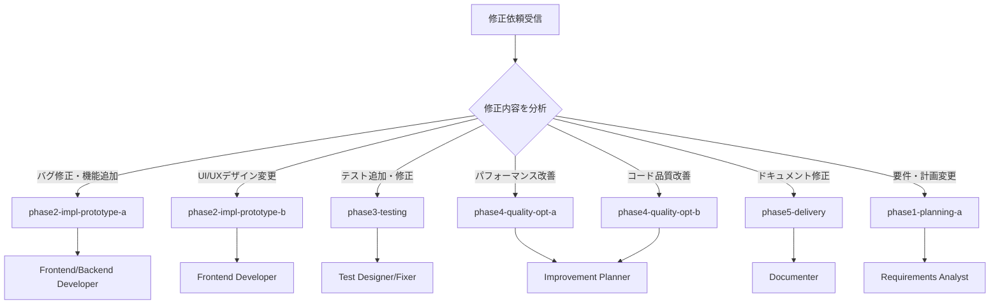

# 📋 Worktree役割インデックス

## 🎯 このファイルの目的

Claude Codeが修正依頼を受けた際に、適切なworktreeとサブエージェントを選択するためのインデックスです。

---

## 🔗 Worktree-Branch マッピング表（重要）

**必ずこのマッピングに従ってください:**

| Worktreeディレクトリ | 対応ブランチ名 | マージコマンド |
|---------------------|---------------|---------------|
| `worktrees/phase1-planning-a/` | `phase/planning-a` | `git merge phase/planning-a` |
| `worktrees/phase1-planning-b/` | `phase/planning-b` | `git merge phase/planning-b` |
| `worktrees/phase2-impl-prototype-a/` | `phase/impl-prototype-a` | `git merge phase/impl-prototype-a` |
| `worktrees/phase2-impl-prototype-b/` | `phase/impl-prototype-b` | `git merge phase/impl-prototype-b` |
| `worktrees/phase2-impl-prototype-c/` | `phase/impl-prototype-c` | `git merge phase/impl-prototype-c` |
| `worktrees/phase3-testing/` | `phase/testing` | `git merge phase/testing` |
| `worktrees/phase4-quality-opt-a/` | `phase/quality-opt-a` | `git merge phase/quality-opt-a` |
| `worktrees/phase4-quality-opt-b/` | `phase/quality-opt-b` | `git merge phase/quality-opt-b` |
| `worktrees/phase5-delivery/` | `phase/delivery` | `git merge phase/delivery` |

**命名規則:**
- Worktreeディレクトリ: `phase{N}-{name}/`（ハイフン区切り）
- Gitブランチ: `phase/{name}`（スラッシュ区切り、phase番号省略）

---

## 📊 Worktree構成マップ

### Phase 1: 計画（2つのアプローチ）

| Worktree | ブランチ名 | 役割 | 担当エージェント | 使用タイミング |
|----------|-----------|------|----------------|--------------|
| `phase1-planning-a` | `phase/planning-a` | 保守的な計画案 | Requirements Analyst, Planner | 計画の見直し・要件変更 |
| `phase1-planning-b` | `phase/planning-b` | 革新的な計画案 | Requirements Analyst, Planner | 大幅な仕様変更 |

### Phase 2: 実装（3つのプロトタイプ）

| Worktree | ブランチ名 | 役割 | 担当エージェント | 使用タイミング |
|----------|-----------|------|----------------|--------------|
| `phase2-impl-prototype-a` | `phase/impl-prototype-a` | メイン実装プロトタイプ | Frontend/Backend Developer | **機能追加・実装修正（最頻）** |
| `phase2-impl-prototype-b` | `phase/impl-prototype-b` | UI/UX特化プロトタイプ | Frontend Developer | UI/UXデザイン変更 |
| `phase2-impl-prototype-c` | `phase/impl-prototype-c` | 代替実装アプローチ | Frontend/Backend Developer | アーキテクチャ変更 |

### Phase 3: テスト

| Worktree | ブランチ名 | 役割 | 担当エージェント | 使用タイミング |
|----------|-----------|------|----------------|--------------|
| `phase3-testing` | `phase/testing` | テスト環境 | Test Designer, Fixer | **テスト追加・修正** |

### Phase 4: 品質改善（2つの最適化）

| Worktree | ブランチ名 | 役割 | 担当エージェント | 使用タイミング |
|----------|-----------|------|----------------|--------------|
| `phase4-quality-opt-a` | `phase/quality-opt-a` | 品質最適化アプローチA | Evaluator, Improvement Planner | **パフォーマンス改善** |
| `phase4-quality-opt-b` | `phase/quality-opt-b` | 品質最適化アプローチB | Evaluator, Improvement Planner | コード品質改善 |

### Phase 5: 完成処理

| Worktree | ブランチ名 | 役割 | 担当エージェント | 使用タイミング |
|----------|-----------|------|----------------|--------------|
| `phase5-delivery` | `phase/delivery` | 最終成果物作成 | Documenter, Launcher Creator | **ドキュメント修正** |

---

## 🔍 修正依頼時の判断フロー

### メインエージェントの判断ルール



### キーワードベースの判断表

| 修正依頼のキーワード | 選択するworktree | ブランチ名 |
|-------------------|----------------|-----------|
| バグ、エラー、修正、fix | `phase2-impl-prototype-a` | `phase/impl-prototype-a` |
| 機能追加、新機能、実装 | `phase2-impl-prototype-a` | `phase/impl-prototype-a` |
| UI、デザイン、見た目、レイアウト | `phase2-impl-prototype-b` | `phase/impl-prototype-b` |
| テスト、test、カバレッジ | `phase3-testing` | `phase/testing` |
| 遅い、重い、最適化、パフォーマンス | `phase4-quality-opt-a` | `phase/quality-opt-a` |
| リファクタリング、品質、可読性 | `phase4-quality-opt-b` | `phase/quality-opt-b` |
| README、ドキュメント、説明、about.html | `phase5-delivery` | `phase/delivery` |
| 要件、仕様、計画 | `phase1-planning-a` | `phase/planning-a` |

---

## 🚀 使用例

### 例1: 「ログイン機能のバグを修正して」

```bash
# 判断: "バグ" → phase2-impl-prototype-a を使用
cd ~/Desktop/AI-Apps/todo-app-agent/worktrees/phase2-impl-prototype-a/

# 修正作業
# ...

# commit
git add .
git commit -m "fix: ログイン機能のバグ修正"

# mainにマージ
cd ~/Desktop/AI-Apps/todo-app-agent/
git merge phase/impl-prototype-a
```

### 例2: 「UIをもっと見やすくして」

```bash
# 判断: "UI", "見やすく" → phase2-impl-prototype-b を使用
cd ~/Desktop/AI-Apps/todo-app-agent/worktrees/phase2-impl-prototype-b/

# UI修正作業
# ...

# commit
git add .
git commit -m "feat: UIデザイン改善"

# mainにマージ
cd ~/Desktop/AI-Apps/todo-app-agent/
git merge phase/impl-prototype-b
```

### 例3: 「テストカバレッジを上げて」

```bash
# 判断: "テスト", "カバレッジ" → phase3-testing を使用
cd ~/Desktop/AI-Apps/todo-app-agent/worktrees/phase3-testing/

# テスト追加
# ...

# commit
git add .
git commit -m "test: カバレッジ向上のためテスト追加"

# mainにマージ
cd ~/Desktop/AI-Apps/todo-app-agent/
git merge phase/testing
```

---

## 🔄 このファイルの更新が必要な場合

以下の操作を行った場合、このファイルを手動で更新してください：

### 1. 新しいworktreeを追加した場合

```bash
# 例: API専門のworktreeを追加
git worktree add worktrees/phase2-api-specialist -b phase/api-specialist
```

**対応:** 上記の表に新しい行を追加
```markdown
| `phase2-api-specialist` | `phase/api-specialist` | API実装特化 | Backend Developer | API関連の修正 |
```

### 2. 既存worktreeの役割を変更した場合

**対応:** 該当する行の「役割」「担当エージェント」「使用タイミング」を更新

### 3. worktreeを削除した場合

```bash
# 例: 不要なworktreeを削除
git worktree remove worktrees/phase2-impl-prototype-c
```

**対応:** 該当する行を削除

### ⚠️ 注意

- `create_new_app.command` 再実行時はこのファイルも上書きされます
- カスタマイズした場合は、再実行前にバックアップを取ってください

---

## 📝 CLAUDE.mdへの統合

このファイルは **Phase 7（既存アプリの修正・再公開）** で参照されます。

```markdown
### Step 2: 適切なworktreeで修正作業

⚠️ 重要: WORKTREE_INDEX.md を参照して適切なworktreeを選択すること
```

---

## 🎯 最頻使用worktree（優先度順）

修正依頼の大半は以下のworktreeで対応できます：

1. **phase2-impl-prototype-a** (最頻) - 一般的な機能修正・バグ修正
2. **phase3-testing** - テスト追加・修正
3. **phase2-impl-prototype-b** - UI/UX変更
4. **phase5-delivery** - ドキュメント修正
5. **phase4-quality-opt-a** - パフォーマンス改善

迷ったら **phase2-impl-prototype-a** を使用してください。
