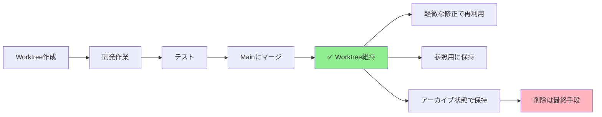
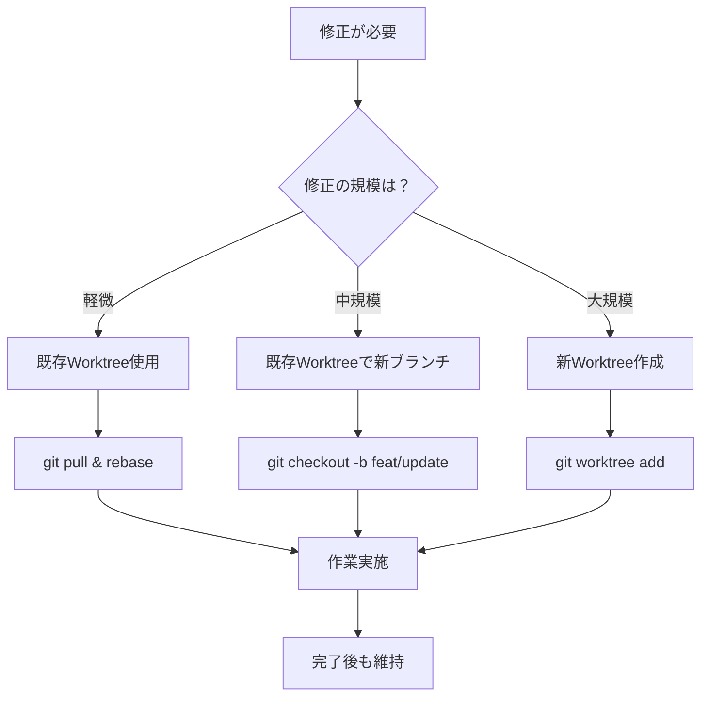

# 📂 Worktree管理ガイド v7.0

## 🎯 基本方針: Worktreeは削除しない

### なぜWorktreeを維持するのか

1. **サブエージェントの継続利用**
   - Phase 6以降もサブエージェントが作業可能
   - 物理的な作業環境が常に存在

2. **修正作業の効率化**
   - 既存環境をそのまま使える
   - 環境構築の時間が不要

3. **開発履歴の保持**
   - どのバージョンで何を実装したか明確
   - 過去のコードを簡単に参照可能

## 📊 Worktree ライフサイクル



## 🗂️ 推奨ディレクトリ構造

```
~/Desktop/AI-Apps/{app-name}-agent/
├── worktrees/
│   ├── mission-v1/          # ✅ 初版（維持）
│   ├── mission-v2/          # ✅ 機能追加版（維持）
│   ├── mission-hotfix/      # ✅ 緊急修正用（維持）
│   └── mission-experiment/  # 🧪 実験用（削除可）
├── WORKTREE_STATUS.json     # 状態管理ファイル
└── src/
```

## 📝 Worktree状態管理

### WORKTREE_STATUS.json
```json
{
  "worktrees": [
    {
      "name": "mission-v1",
      "branch": "feat/v1",
      "status": "completed",
      "created": "2024-12-01",
      "last_modified": "2024-12-05",
      "purpose": "初版開発",
      "can_reuse": true,
      "files_count": 156,
      "size_mb": 12.5
    },
    {
      "name": "mission-v2",
      "branch": "feat/v2",
      "status": "active",
      "created": "2024-12-10",
      "last_modified": "2024-12-12",
      "purpose": "AI画像生成機能追加",
      "can_reuse": true,
      "files_count": 189,
      "size_mb": 18.3
    }
  ],
  "active": "mission-v2",
  "total_size_mb": 30.8,
  "recommended_action": "keep_all"
}
```

## 🔧 Worktree操作コマンド

### 基本コマンド

```bash
# Worktree一覧確認
git worktree list

# 新規Worktree作成
git worktree add -b feat/v3 ./worktrees/mission-v3 main

# Worktreeのロック（誤削除防止）
git worktree lock ./worktrees/mission-v1

# ロック解除
git worktree unlock ./worktrees/mission-v1

# 状態確認スクリプト
./check_worktree_status.sh
```

### 削除判断フローチャート

```python
def should_delete_worktree(worktree_info):
    """Worktree削除の判断ロジック"""

    # 実験用は削除可
    if worktree_info["name"].startswith("experiment-"):
        return True, "実験用Worktreeは削除可"

    # 3ヶ月以上未使用
    if days_since_last_use(worktree_info) > 90:
        return True, "長期間未使用"

    # ディスク容量逼迫（90%以上使用）
    if disk_usage_percent() > 90 and worktree_info["size_mb"] > 100:
        return True, "ディスク容量不足"

    # デフォルトは維持
    return False, "維持推奨"
```

## 📋 用途別Worktree管理

### 1. 開発用Worktree
```bash
worktrees/mission-v1/     # メインバージョン開発
worktrees/mission-v2/     # 次期バージョン開発
```
**管理方針**: 永続的に維持

### 2. 修正用Worktree
```bash
worktrees/mission-hotfix/     # 緊急修正
worktrees/mission-bugfix/     # バグ修正
```
**管理方針**: 修正完了後も維持（履歴として）

### 3. 実験用Worktree
```bash
worktrees/experiment-ai/      # AI機能実験
worktrees/experiment-ui/      # UI実験
```
**管理方針**: 実験終了後に削除可

### 4. レビュー用Worktree
```bash
worktrees/review-pr-123/      # PR #123のレビュー
```
**管理方針**: レビュー完了後に削除可

## 🔄 コード修正時の Worktree 選択



## 🛠️ メンテナンススクリプト

### check_worktree_status.sh
```bash
#!/bin/bash
# Worktree状態チェックスクリプト

echo "📊 Worktree状態レポート"
echo "========================"

# Worktree一覧
echo -e "\n📂 現在のWorktree:"
git worktree list

# 各Worktreeのサイズ
echo -e "\n💾 ディスク使用量:"
for dir in worktrees/*/; do
    if [ -d "$dir" ]; then
        size=$(du -sh "$dir" | cut -f1)
        echo "  $(basename $dir): $size"
    fi
done

# 推奨アクション
echo -e "\n💡 推奨アクション:"
total_size=$(du -sh worktrees/ | cut -f1)
echo "  総使用量: $total_size"

if [[ $(df -h . | awk 'NR==2 {print $5}' | sed 's/%//') -gt 80 ]]; then
    echo "  ⚠️ ディスク容量に注意"
    echo "  実験用Worktreeの削除を検討してください"
else
    echo "  ✅ すべてのWorktreeを維持推奨"
fi
```

### update_worktree_status.py
```python
#!/usr/bin/env python3
"""Worktree状態をJSON更新"""

import json
import subprocess
from pathlib import Path
from datetime import datetime

def update_status():
    status = {
        "worktrees": [],
        "total_size_mb": 0,
        "updated": datetime.now().isoformat()
    }

    # git worktree list を解析
    result = subprocess.run(
        ["git", "worktree", "list", "--porcelain"],
        capture_output=True,
        text=True
    )

    # 各worktreeの情報収集
    for worktree_path in Path("worktrees").glob("*/"):
        if worktree_path.is_dir():
            info = {
                "name": worktree_path.name,
                "path": str(worktree_path),
                "size_mb": get_dir_size(worktree_path),
                "files_count": count_files(worktree_path),
                "last_modified": get_last_modified(worktree_path)
            }
            status["worktrees"].append(info)
            status["total_size_mb"] += info["size_mb"]

    # JSON保存
    with open("WORKTREE_STATUS.json", "w") as f:
        json.dump(status, f, indent=2)

    print(f"✅ 状態更新完了: {len(status['worktrees'])} worktrees")

if __name__ == "__main__":
    update_status()
```

## ⚠️ 注意事項

### やってはいけないこと
1. ❌ 作業完了直後の `git worktree remove`
2. ❌ 理由なくWorktreeを削除
3. ❌ 他人のWorktreeを削除

### 推奨される運用
1. ✅ Worktreeは基本的に維持
2. ✅ 削除前に `WORKTREE_STATUS.json` 更新
3. ✅ 3ヶ月ごとに使用状況レビュー

## 📈 メリットまとめ

| 項目 | 従来（削除） | 新方式（維持） |
|------|-------------|----------------|
| Phase 6実行 | ❌ 作業環境なし | ✅ Worktree内で実行 |
| 修正作業 | 🐢 環境再構築必要 | 🚀 即座に開始可能 |
| サブエージェント | ❌ 委譲不可 | ✅ 継続的に委譲可能 |
| 履歴参照 | 🔍 Gitログのみ | 📂 実ファイルで確認 |
| ディスク使用 | 💾 少ない | 💾 やや多い（許容範囲） |

## 🎉 結論

**Worktreeは貴重な開発資産として維持しましょう！**

削除は最終手段であり、基本的には全てのWorktreeを保持することで、
効率的な開発と確実なワークフロー実行が可能になります。